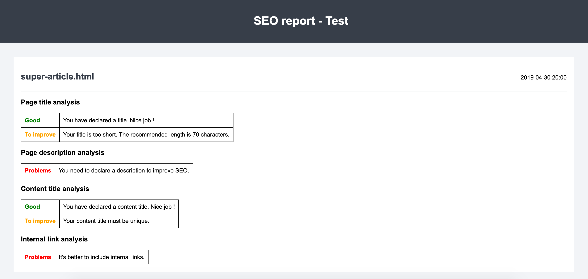

# SEO Plugin for Pelican 🇫🇷

[](https://github.com/pelican-plugins/seo/actions)
[](https://pypi.org/project/pelican-seo/)
[](https://pypi.org/project/pelican-seo/)


This plugin helps you improve your Pelican site SEO (Search Engine Optimization) to reach the top positions on search engines. To see what this SEO plugin can do for you, visit the [Usage](#usage) section.

| Author          | GitHub                            |
| :-------------: | :-------------------------------: |
| Maëva Brunelles | https://github.com/MaevaBrunelles |

## Why Use This Plugin?

If:

* you are not familiar with SEO
* you want an easy way to apply SEO fundamentals
* you need help improving the SEO of your Pelican site

… then this plugin is for you!

SEO comes with two features to help you:

* [SEO Report](#seo-report) — Generates an HTML report based on article analysis, indicating what is good, what could be improved, and what is problematic. Useful if you want to improve the ranking of your articles.
* [SEO Enhancer](#seo-enhancer) — Generates robot indexing guidelines, HTML tags, structured data, and if enabled, Open Graph tags. Useful if you want to control how your site appears in search engine results and in social medias.

## Installation

This plugin can be installed via:

    python -m pip install pelican-seo

As long as you have not explicitly added a `PLUGINS` setting to your Pelican settings file, then the newly-installed plugin should be automatically detected and enabled. Otherwise, you must add `seo` to your existing `PLUGINS` list. For more information, please see the [How to Use Plugins](https://docs.getpelican.com/en/latest/plugins.html#how-to-use-plugins) documentation.

## Requirements

The above installation step should automatically install Beautiful Soup 4, which the SEO plugin requires. The following command will manually install this dependency:

    python -m pip install beautifulsoup4

Please keep in mind that the `SITEURL` Pelican setting must be defined in order for this plugin to function as intended.

## Usage

You can enable/disable parent features by setting them to `True` or `False` in your Pelican settings.
The **default configuration is as stated below**:

```python
# pelicanconf.py or publishconf.py
SEO_REPORT = True  # SEO report is enabled by default
SEO_ENHANCER = False  # SEO enhancer is disabled by default
SEO_ENHANCER_OPEN_GRAPH = False # Subfeature of SEO enhancer
SEO_ENHANCER_TWITTER_CARDS = False # Subfeature of SEO enhancer
```

Open Graph and Twitter Cards options are part of the SEO enhancer feature, and may be enabled to generate social tags.
Please note that :
 * `SEO_ENHANCER` setting must be enabled in order to use this feature
 * `SEO_ENHANCER_OPEN_GRAPH` setting must be enabled in order to use
  `SEO_ENHANCER_TWITTER_CARDS` (see [why](#twitter-cards))

The SEO plugin runs when you [generate your site](https://docs.getpelican.com/en/stable/quickstart.html#generate-your-site). If you want to see SEO logging in your console output, add the `--verbose` option to your `pelican` invocation:

```bash
$ pelican content --verbose
-> SEO plugin initialized
-> SEO plugin - SEO Report: seo_report.html file created
-> SEO plugin - SEO Enhancement: robots.txt file created
-> Writing /output/my-first-review.html
-> SEO plugin - SEO Enhancement: Done for /output/my-first-review.html
Done: Processed 1 articles, 0 drafts, 0 pages, 0 hidden pages and 0 draft pages in 0.17 seconds.
```

### SEO Report

The SEO plugin analyzes all your articles and pages and generate an SEO HTML report in your Pelican project root: `seo-report.html`

Example:



You can set limits for article and page analysis in the plugin settings.py. By default, it's set up to 10 articles and 10 pages.

```python
SEO_ARTICLES_LIMIT = 10
SEO_PAGES_LIMIT = 10
```

The SEO analysis begins with the most recent articles/pages, according to the `date` metadata, and is focused on the following criteria:

* Page title: `<title></title>`
* Page description: `<meta name="description" content="" />`
* Heading content: `<h1></h1>`
* Internal site links: `<a href="SITEURL/..."></a>`

The above information is defined in your source content, such as the following example Markdown file:

```markdown
Title: Page Title
Description: Page Description

# Heading Content

[Internal link](https://example.com/about.html)
```

Once the SEO analysis has generated a report, optimize your articles and pages according to the report’s recommendations, and then repeat the analysis to see whether everything comes up green.

### SEO Enhancer

The SEO Enhancer module generates the following for you:

* robots file
* HTML enhancements
* structured data
* Open Graph tags (if enabled)
* Twitter Cards tags (if enabled)

#### Robots.txt File

The generated `robots.txt` file indicates to search engines which pages they should index. By default, search engine bots are allowed to crawl and index all pages.

```
User-agent: *
```

To disallow crawling and/or forbid indexing for a given article/page, add the following to your article/page metadata:

```
Disallow: True
Noindex: True
```

A `robots.txt` file will be generated at your web site root, as per the `OUTPUT_PATH` setting (Pelican’s default is `output/`).

```
# robots.txt
User-agent: *

Disallow: example.html
Noindex: other-example.html
```

#### Canonical URL Tag

The SEO Enhancer automatically adds canonical link metadata to `<head>` tags in order to avoid presenting duplicate content to search engines:

1. If you have declared the `:external_canonical:` metadata field, the SEO Enhancer will use it. It expects a URL, e.g. `https://www.example.com/external_canonical_article.html`. It can be used if you syndicate content from third parties or want to include your own posts that are already hosted elsewhere. The SEO Enhancer will prefer `:external_canonical:` over the `:save_as:` metadata field.
2. If you have declared the `:save_as:` metadata field, the SEO Enhancer will use it to construct a canonical link. However if the `:external_canonical:` is set, the `:save_as:` field will be ignored.
3. If both `:external_canonical:` or `:save_as:` metadata fields are absent, it will construct the canonical link using the output filename created.

Example:

```
# article.md
External_Canonical: https://www.example.com/external_canonical_article.html

# article.rst
:external_canonical: https://www.example.com/external_canonical_article.html
```

will result in the following addition to `<head>` tags:

```html
<link rel="canonical" href="https://www.example.com/external_canonical_article.html" />
```

In all other cases the SEO Enhancer will generate the following:

```html
<link rel="canonical" href="<SITEURL>/example.html" />
```

#### Structured Data

The SEO Enhancer automatically adds structured data in the `<head>` tag in order to improve the display of result snippets in search engines. Articles will have both article schema and breadcrumb schema, while pages will only have breadcrumb schema.

Structured data is based on [Schema.org](https://schema.org/) vocabulary, with `JSON-LD` encoding. Note that schemas generated by default are compliant with Schema.org but not (by default) Google-compliant. The latter requires additional metadata.

##### Breadcrumb Schema

Based on [BreadcrumbList schema](https://schema.org/BreadcrumbList):

```json-ld
{
    "@context": "https://schema.org",
    "@type": "BreadcrumbList",
    "itemListElement": [
        {
            "@type": "ListItem",
            "position": :n=1:,
            "name": :Sitename:,
            "item": :SITEURL:
        },
        {
            "@type": "ListItem",
            "position": :n+1:,
            "name": :name:,
            "item": :url:
        },
        {
            "@type": "ListItem",
            "position": :n+x:,
            "name": :name:,
            "item": :url:
        }
    ]
}
```

Each path element has a `ListItem`, even folders, so it’s better to create a user-friendly page for those (otherwise you’ll get your server’s default page).

##### Article schema

Based on [Article schema](https://schema.org/Article):

```json-ld
{
    "@context": "https://schema.org",
    "@type": "Article",
    "author": {
        "@type": "Person",
        "name": :author:
    },
    "publisher": {
        "@type": "Organization",
        "name": :sitename:,
        "logo": {
            "@type": "ImageObject",
            "url": :logo:
        }
    },
    "headline": :title:,
    "about": :category:,
    "datePublished": :publication_date:,
    "image": :image:
}
```

`:logo:` and `:image:` fields are not required by Schema.org but are by Google.

To populate the `:logo:` field, add a `LOGO` setting to your Pelican settings file containing an absolute link to your site logo image:

```
# pelicanconf.py
LOGO = "https://www.example.com/logo.jpg"
```

To populate the `:image:` field, add an image metadata field to your Markdown/reST content:

```
# article.md
Image: https://www.example.com/article-image.jpg

# article.rst
:image: https://www.example.com/article-image.jpg
```

#### Open Graph

Based on [Open Graph protocol](https://ogp.me), the SEO plugin implements required properties and some aditionnals ones:

```
<meta property="og:url" content=":fileurl:" />
```
`:fileurl:`: An absolute URL build with the `SITEURL` setting and the file URL.

```
<meta property="og:type" content=":type:" />
```
`:type:`: Either `article` or `page`.

```
<meta property="og:title" content=":title:" />
<meta property="og:description" content=":description:" />
<meta property="og:image" content=":image:" />
```
`:title:`, `:description:`, `:image:`: If you need to optimize your social links, you can write dedicated Open Graph content as described below in the file metadata:

```
og_title: Specific title for Open Graph
og_description: Specific description
og_image: https://www.example.com/og-image.jpg
```

If these metadata are not declared, `:title:`, `:description:`, `:image:` will be filled by the default `Title`, `Description` (Pelican metadata) and `Image` (plugin metadata) if they exist.

```
<meta property="og:locale" content=":language:">
```
`:language:`: The site language as defined in `LOCALE` Pelican setting. If not filled, it will try to get the default system locale.

#### Twitter Cards

The Twitter Cards feature requires Open Graph feature to be functional. To avoid the duplication of similar tags, [Twitter falls back on some Open Graph tags](https://developer.twitter.com/en/docs/twitter-for-websites/cards/guides/getting-started#opengraph) if Twitter's are not present.

Based on [Twitter guide](https://developer.twitter.com/en/docs/twitter-for-websites/cards/overview/summary), the SEO plugin implements the Summary Card:

```
<meta name="twitter:card" content="summary" />
```

```
<meta name="twitter:site" content=":tw_account:" />
```
`:tw_account:`: The Twitter @account to link to the card. You can fill in the file metadata, but it's not a required property.

The other properties required by Twitter are created thanks to Open Graph feature.

## Contributing

Contributions are welcome and much appreciated. Every little bit helps. You can contribute by improving the documentation, adding missing features, and fixing bugs. You can also help out by reviewing and commenting on [existing issues][].

To start contributing to this plugin, review the [Contributing to Pelican][] documentation, beginning with the **Contributing Code** section.

[existing issues]: https://github.com/pelican-plugins/seo/issues
[Contributing to Pelican]: https://docs.getpelican.com/en/latest/contribute.html

License
-------

This project is licensed under the AGPL-3.0 license.
